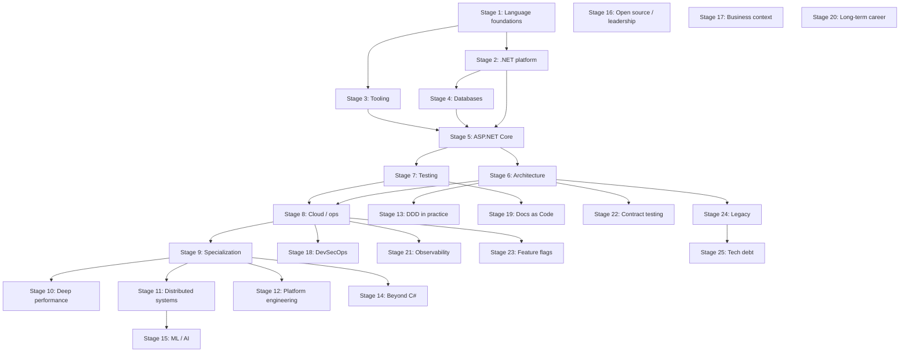

# C# Roadmap: From Zero to Pro

> 🇷🇺 **Russian version**: [Csharp_Roadmap](https://github.com/Develp10/Csharp_Roadmap)

> 📢 Author's Telegram channel: [t.me/csharp_ci](https://t.me/csharp_ci) — roadmap updates, C# and .NET materials, breakdowns of practices and useful links.

A practical guide to growing as a C# developer. The material is put together for those who want engineering depth, not just to click their way through CRUD tutorials. You'll find a learning sequence, best practices, resources, and a sober take on working with AI tools while staying employable.

The roadmap is alive. PRs with clarifications, links, and experience are welcome. See the [Contributing](#contributing) section.

## TL;DR in 30 seconds

**What this is.** A growth path from junior to principal in the .NET stack. 25 stages, resources, practices, checklists.

**Who it's for.** Anyone learning C# from scratch, preparing for interviews, climbing out of the middle-developer plateau, or trying to figure out what's missing for a senior+ role.

**Where to start right now:**

1. Open [How to use this roadmap](#how-to-use-this-roadmap) and the [stage → level matrix](#stage--level-matrix).
2. Find your level. Pick one stage from "required" that you have the weakest grip on.
3. Close it out in 2–4 weeks using this loop: read → take notes → pet project → retrospective.
4. Come back here once a week with a concrete question, not "what else should I read."

**In short.** A deep foundation beats a trendy stack. A pet project beats a course. English at B2 multiplies your salary. AI tools speed up routine work and kill skills if you use them as a substitute for thinking.

## Five rules for surviving the industry

The compressed version of best practices. Print it out and pin it above your monitor.

1. **Simple solution by default.** Add complexity only when the requirement comes from reality, not from imagination.
2. **Don't optimize without measuring.** A profiler and BenchmarkDotNet will refute half of your intuitions.
3. **Every async method takes a CancellationToken.** No exceptions.
4. **Test behavior, not implementation.** Excessive mocking is an architectural smell.
5. **Document "why," not "what."** What the code does is visible in the code. Why it does it that way is not.

## How to use this roadmap

- Don't try to plow through everything in a quarter. This is a map for 3–5 years of deliberate work.
- Stages 1–8 are the baseline trajectory from junior to confident middle. Go in order.
- Stages 9–17 are specialization and Senior+. Pick what your market and product need.
- Each stage = reading + notes + working project + retrospective. Without a project, the topic doesn't count as covered.
- Revisit earlier material every six months: foundations change meaning once you've grown.
- Track progress in a fork of this repo. A public commit streak disciplines better than any mentor.

## Table of contents

- [Why learn to code in the AI era](#why-learn-to-code-in-the-ai-era)
- [Stage 1. Language and platform foundations](#stage-1-language-and-platform-foundations-12-months)
- [Stage 2. Deeper into the .NET platform](#stage-2-deeper-into-the-net-platform-12-months)
- [Stage 3. Professional tooling](#stage-3-professional-tooling-in-parallel-with-stage-2)
- [Stage 4. Databases and data access](#stage-4-databases-and-data-access-12-months)
- [Stage 5. ASP.NET Core and web development](#stage-5-aspnet-core-and-web-development-23-months)
- [Stage 6. Architecture and design](#stage-6-architecture-and-design-ongoing)
- [Stage 7. Code quality and testing](#stage-7-code-quality-and-testing-ongoing)
- [Stage 8. Cloud and operations](#stage-8-cloud-and-operations-12-months)
- [Stage 9. Specialization](#stage-9-specialization)
- [Stage 10. Deep performance](#stage-10-deep-performance-and-systems-programming)
- [Stage 11. Distributed systems](#stage-11-advanced-distributed-systems)
- [Stage 12. Platform engineering](#stage-12-platform-engineering)
- [Stage 13. DDD in practice](#stage-13-domain-driven-design-in-practice)
- [Stage 14. Expanding the stack](#stage-14-expanding-the-stack-beyond-c)
- [Stage 15. ML and AI engineering](#stage-15-ml-and-ai-engineering-in-the-net-stack)
- [Stage 16. Open source and technical leadership](#stage-16-open-source-and-technical-leadership)
- [Stage 17. Business context](#stage-17-business-context-and-product-thinking)
- [Stage 18. DevSecOps and Supply Chain Security](#stage-18-devsecops-and-supply-chain-security)
- [Stage 19. Documentation as Code](#stage-19-documentation-as-code-and-engineering-writing)
- [Stage 20. Sustainable career and ethics](#stage-20-sustainable-career-ethics-and-the-long-game)
- [Stage 21. Observability](#stage-21-observability-at-the-senior-level)
- [Stage 22. Contract testing and API evolution](#stage-22-contract-testing-and-api-evolution)
- [Stage 23. Feature flags and progressive delivery](#stage-23-feature-flags-and-progressive-delivery)
- [Stage 24. Working with legacy and large migrations](#stage-24-working-with-legacy-and-large-migrations)
- [Stage 25. Managing technical debt](#stage-25-managing-technical-debt-as-a-process)
- [Visual growth map](#visual-growth-map)
- [First 90 days plan](#first-90-days-plan-for-those-just-starting)
- [Pet project structure](#minimal-pet-project-structure-that-opens-doors)
- [Idiomatic C# reference snippets](#reference-snippets-what-separates-idiomatic-c-from-c-written-in-java-style)
- [Pet project ideas by level](#pet-project-ideas-by-difficulty-level)
- [Glossary of key terms](#glossary-of-key-terms)
- [Extended resources](#extended-resources-per-stage)
- [Weekly retrospective template](#weekly-learning-retrospective-template)
- [Best practices](#best-practices-that-save-years)
- [Working with AI tools](#working-with-ai-tools-without-degrading)
- [Level readiness checklist](#level-readiness-checklist)
- [Learning antipatterns](#learning-antipatterns-to-avoid)
- [Minimum bookshelf](#useful-reading)
- [Awesome resources and communities](#awesome-resources-and-communities)
- [FAQ](#faq)
- [Contributing](#contributing)
- [License](#license)

## Why learn to code in the AI era

AI generates text that looks like code. The engineer is the one responsible for the system handling load, not losing the customer's money, and not falling over in production at night. A language model doesn't know your business context, doesn't read between the lines of requirements, and bears no responsibility for an architectural decision that will live for five years.

To use AI as a lever, you need to understand what it generated. To spot races in async code, to tell a working pattern from a cargo cult, to read legacy and design modules so they can be maintained. Without a foundation, you'll just be tapping Tab in Copilot and piling up technical debt that you won't be able to dig out of later.

The market is shifting away from juniors stamping out forms toward middle+ engineers who design systems and validate AI output. You need to learn deeper than before, not shallower.

## Stage 1. Language and platform foundations (1–2 months)

Install the current .NET SDK (LTS — .NET 8, latest release — .NET 9), JetBrains Rider, or Visual Studio. VS Code with the C# Dev Kit extension is also a viable option for those who prefer a lightweight editor.

What to master at this stage:

- C# syntax: value and reference types, nullable reference types, pattern matching, records, init-only properties, switch expressions.
- Control flow, methods, overloads, optional and named arguments.
- OOP done right: encapsulation, inheritance, polymorphism, interfaces, abstract classes. Understanding when composition beats inheritance.
- Generics, type constraints, covariance and contravariance.
- Delegates, events, lambda expressions, closures and their pitfalls.
- Exceptions: hierarchy, when-filters, finally, correct rethrowing without losing the stack (`throw` vs `throw ex`).
- Basic collection usage: `List`, `Dictionary`, `HashSet`, `Queue`, `Stack`, `ImmutableCollections`.
- LINQ to Objects: deferred execution, materialization, typical performance traps.

Resources:

- "C# in Depth" by Jon Skeet — the minimum mandatory book for understanding the language.
- Official Microsoft Learn documentation for C# and .NET.
- Nick Chapsas on YouTube for short, practical breakdowns.
- "C# Fundamentals" course on Pluralsight (Scott Allen).

Practice: write a moderately complex console app (e.g., a text-based task manager with JSON persistence), solve 50–100 problems on LeetCode or Codewars in C#.

## Stage 2. Deeper into the .NET platform (1–2 months)

This is where what separates a junior from a middle developer begins. You need to understand how exactly your code is executed.

Topics:

- CLR, JIT, AOT, Tiered Compilation, ReadyToRun.
- Memory management: stack, heap, GC generations, Large Object Heap, Server vs Workstation GC.
- `Span`, `Memory`, `ref struct`, `stackalloc` and why they exist.
- Async/await internals: `SynchronizationContext`, `ConfigureAwait`, `ValueTask`, cancellation via `CancellationToken`, the traps of sync-over-async and async void.
- `Thread`, `ThreadPool`, `Task`, `Parallel`, `Channels`, synchronization primitives (`lock`, `SemaphoreSlim`, `Interlocked`, `ReaderWriterLockSlim`).
- Reflection, attributes, Source Generators (the modern alternative to reflection on hot paths).
- IO: streams, Pipelines, async file operations.
- Serialization: `System.Text.Json`, contracts, custom converters, performance compared to Newtonsoft.Json.

Resources:

- "Pro .NET Memory Management" by Konrad Kokosa — a deep dive into the GC.
- "Concurrency in C# Cookbook" by Stephen Cleary.
- Stephen Toub's blog on devblogs.microsoft.com — the best source on performance and async.
- Nick Chapsas, performance series.

Practice: write your own LRU cache, a simple object pool, measure performance with BenchmarkDotNet.

## Stage 3. Professional tooling (in parallel with stage 2)

Without these tools, a strong team won't hire you:

- Git: branching strategies (trunk-based, GitHub Flow), rebase, cherry-pick, conflict resolution, working with large repositories.
- Command line, basic Bash or PowerShell.
- Docker: images, layers, multi-stage builds, docker-compose, networking modes.
- Linux at a confident-user level: processes, permissions, systemd, logging.
- CI/CD: GitHub Actions or Azure DevOps Pipelines.
- Debugging: memory dumps, `dotnet-dump`, `dotnet-counters`, `dotnet-trace`, PerfView.
- BenchmarkDotNet for measuring performance and refuting your own intuitions.

Resources:

- Pro Git book (free on git-scm.com).
- "Docker Deep Dive" by Nigel Poulton.
- Microsoft Learn on .NET application diagnostics.

## Stage 4. Databases and data access (1–2 months)

- SQL at a confident level: JOIN, subqueries, window functions, indexes, execution plans, transactions and isolation levels.
- PostgreSQL and SQL Server as primary databases.
- Entity Framework Core: change tracking, lazy/eager/explicit loading, the N+1 problem, `AsNoTracking`, compiled queries, migrations.
- Dapper and raw ADO.NET for hot paths and complex queries.
- Redis for caching and queues.
- NoSQL basics: MongoDB or Cosmos DB, knowing when they're appropriate.

Resources:

- "SQL Antipatterns" by Bill Karwin.
- "Use the Index, Luke" (free online) — the best material on indexes.
- EF Core documentation with its performance section.

Practice: write a service that loads a million records from the database, find and fix an N+1, measure the difference.

## Stage 5. ASP.NET Core and web development (2–3 months)

- Kestrel, middleware pipeline, DI container, configuration and the Options pattern.
- Minimal APIs and controllers, when to choose which.
- Authentication and authorization: JWT, OAuth 2.0, OpenID Connect, Identity, policies and roles.
- Validation (FluentValidation), mapping (Mapster, manual mapping instead of AutoMapper on new projects).
- Logging via `ILogger`, structured logs, Serilog, OpenTelemetry for tracing and metrics.
- gRPC, SignalR, GraphQL (HotChocolate) at an overview level, for the right tasks.
- API versioning, Swagger/OpenAPI, idempotency, error handling (`ProblemDetails`).
- Health checks, graceful shutdown, configuration via environment variables and secret stores.

Resources:

- "ASP.NET Core in Action" by Andrew Lock.
- Andrew Lock's blog (andrewlock.net) — deep dives into the internals.
- Microsoft's ASP.NET Core documentation.

Practice: build an API for tasks with authentication, roles, logging, containerization, and deployment to the cloud.

## Stage 6. Architecture and design (ongoing)

- SOLID without fanaticism, understanding the real cost of every principle.
- DDD: aggregates, value objects, bounded contexts, ubiquitous language. Read "Domain-Driven Design" by Evans and "Implementing DDD" by Vernon.
- Clean Architecture, Hexagonal, Onion. Be able to explain what problem each one solves.
- CQRS and MediatR, Event Sourcing (understand when it's appropriate).
- Integration patterns: Outbox, Saga, Idempotency Key, Retry with exponential backoff, Circuit Breaker (Polly).
- Microservices vs modular monolith. Default to a modular monolith; move to microservices deliberately.
- Queues and brokers: RabbitMQ, Kafka, Azure Service Bus. MassTransit as an abstraction.
- Distributed transactions, eventual consistency, the CAP theorem in practice.

Resources:

- "Designing Data-Intensive Applications" by Martin Kleppmann — the backend book of the decade.
- "Building Microservices" by Sam Newman.
- Vladimir Khorikov's blog (enterprisecraftsmanship.com).
- CodeOpinion channel (Derek Comartin).

## Stage 7. Code quality and testing (ongoing)

- Unit tests: xUnit, NUnit. FluentAssertions for readable assertions.
- Mocks: NSubstitute or Moq. Excessive mocking signals architecture problems.
- Integration tests through `WebApplicationFactory` and Testcontainers (spin up a real Postgres in Docker for tests).
- Approaches: TDD where it makes sense; Arrange-Act-Assert; Given-When-Then.
- Property-based testing (FsCheck) for algorithms.
- Code review culture, static analysis (Roslyn analyzers, SonarQube), EditorConfig.
- Coverage: the number of percentage points isn't what matters, coverage of critical paths is.

Resources:

- "Unit Testing: Principles, Practices, and Patterns" by Vladimir Khorikov.
- "The Art of Unit Testing" by Roy Osherove.

## Stage 8. Cloud and operations (1–2 months)

- Azure or AWS at the Associate certification level. For the .NET stack, Azure is closer to home, but AWS will land you work too.
- Kubernetes basics: Pod, Deployment, Service, Ingress, ConfigMap, Secret, Helm.
- Observability: metrics (Prometheus, Application Insights), tracing (Jaeger, OpenTelemetry), logs (Loki, ELK).
- Infrastructure as Code: Terraform or Bicep.
- Security: OWASP Top 10, secret management, secure token storage, protection from SQL injection and SSRF.

## Stage 9. Specialization

Once the foundation is covered, pick a direction to go deeper:

- High-load backend: performance, low-allocation code, Span, profiling.
- Distributed systems: Kafka, Event Sourcing, CQRS in production.
- Gamedev: Unity, ECS, platform-specific optimization.
- Desktop: WPF, Avalonia, MAUI.
- DevOps direction within .NET teams.
- ML.NET and integrating AI into C# products.

## Best practices that save years

- **Write code to be read, not to be written.** Your code will be read ten times more often than it's written.
- **Simple solution by default.** Add complexity only when the requirement is confirmed by reality, not by imagination.
- **No god objects, no magic numbers.** Configuration goes into Options, constants into named fields.
- **Structured logs with request correlation.** Without them, production diagnostics turn into guesswork.
- **Never catch `Exception` silently.** Either handle it meaningfully or let it bubble up.
- **Pass `CancellationToken` to every async method by default.**
- **No `.Result` or `.Wait()` in async code.** That's the road to deadlocks.
- **DI without service locator.** Dependencies arrive through the constructor, explicitly.
- **API contracts are stable; breaking changes go through versioning.**
- **DB migrations are backward-compatible.** First add the column, then deploy the code, then remove the old thing.
- **Measure before optimizing.** BenchmarkDotNet, profiler, production metrics.

## Working with AI tools without degrading

AI tools speed up routine work and save hours on boilerplate. They also kill skills if you use them instead of thinking.

What to use:

- GitHub Copilot or Cursor in your editor for autocomplete and quick boilerplate generation.
- JetBrains AI Assistant for those who live in Rider.
- Claude and ChatGPT for design, breaking down other people's code, explaining complex concepts, reviewing architectural decisions.
- Claude Code or Codex CLI for agentic tasks: refactoring, migrations, generating tests at scale.
- Supermaven or Codeium as alternatives to Copilot.
- Perplexity for searching through documentation and recent discussions.

Principles for healthy AI use:

- Every generated chunk passes through your understanding. If you can't explain what a line does, don't commit it.
- AI is good for boilerplate, migrations, tests, documentation, and explanations. AI is weak at architecture, working with unique domains, and production under load.
- Ask the model to explain alternatives and risks, not just hand you a solution.
- Don't feed proprietary code or secrets into public models. Use corporate instances or local models.
- Once a week, solve a problem entirely without AI. It keeps the muscle in shape.
- Learn the fundamentals more deeply than before. Surface-level skills get automated first.

## How to stay relevant

Technologies change, but the fundamental skills (algorithms, design, communication, reading other people's code) last for decades. A strategy for a long career:

- Once a quarter, read one serious book on fundamentals (DDIA, Clean Architecture, books by Skeet and Kleppmann).
- Subscribe to blogs: devblogs.microsoft.com, Andrew Lock, Vladimir Khorikov, Steve Gordon, Konrad Kokosa, Stephen Cleary.
- Follow .NET and C# releases on GitHub: dotnet/runtime, dotnet/aspnetcore.
- Pet projects where you try things you don't get to use at work yet.
- Contribute to open source. One accepted PR to a popular library teaches more than ten courses.
- Conferences: .NET Conf, NDC, DotNext. Recordings are free on YouTube.
- Mentoring and talks. Explaining material exposes holes in your understanding faster than anything else.

## Level readiness checklist

**Junior:** writes C# confidently, knows ASP.NET Core basics, works with EF Core, understands Git, covers code with tests, reads other people's code without panicking.

**Middle:** designs modules, understands async and memory, writes performant code, gets SQL and indexes, sets up CI/CD, does code reviews, makes informed choices between approaches.

**Senior:** designs systems, sees technical debt and knows how to pay it down, knows distributed systems, works with production and incidents, mentors the team, influences technical decisions beyond their own module.

**Lead/Staff:** shapes technical strategy, picks the stack, sets up quality processes, talks to the business in their language, owns outcomes, not code.

## Useful reading

An extended book list per roadmap stage. A star (★) marks the "minimum must-read."

### C# language and the .NET platform

- ★ Jon Skeet, "C# in Depth" — deep understanding of the language.
- ★ Konrad Kokosa, "Pro .NET Memory Management" — GC, allocations, diagnostics.
- Stephen Cleary, "Concurrency in C# Cookbook" — async/await, parallelism, synchronization.
- Andrew Troelsen, Philip Japikse, "Pro C# 10 with .NET 6/8" — platform reference.
- Mark J. Price, "C# 12 and .NET 8 — Modern Cross-Platform Development".
- Sasha Goldshtein, "Pro .NET Performance" — performance at the CLR level.
- Ben Watson, "Writing High-Performance .NET Code" — practical optimizations.
- Andrey Akinshin, "Pro .NET Benchmarking" — correct measurement with BenchmarkDotNet.

### ASP.NET Core and web development

- ★ Andrew Lock, "ASP.NET Core in Action" — framework fundamentals.
- Dino Esposito, "Programming ASP.NET Core" — practice and patterns.
- Christian Nagel, "Professional C# and .NET" — a broad ecosystem overview.

### Databases and data access

- ★ Bill Karwin, "SQL Antipatterns" — common mistakes and their cures.
- Markus Winand, "SQL Performance Explained" / the online version "Use the Index, Luke" — indexes and plans.
- Jon P. Smith, "Entity Framework Core in Action" — EF Core in practice.
- Alex Petrov, "Database Internals" — how modern databases are built.

### Architecture and design

- ★ Martin Kleppmann, "Designing Data-Intensive Applications" — the backend book of the decade.
- ★ Eric Evans, "Domain-Driven Design" — the original DDD book.
- Vaughn Vernon, "Implementing Domain-Driven Design" — DDD in practice.
- Vlad Khononov, "Learning Domain-Driven Design" — a modern take on DDD.
- Scott Wlaschin, "Domain Modeling Made Functional" — modeling through types.
- Robert C. Martin, "Clean Architecture" and "Clean Code" — with a critical eye.
- Sam Newman, "Building Microservices" and "Monolith to Microservices."
- Gregor Hohpe, "Enterprise Integration Patterns" — integration patterns.
- Mark Richards, Neal Ford, "Fundamentals of Software Architecture."
- Vladik Khononov, "Balancing Coupling in Software Design."

### Code quality and testing

- ★ Vladimir Khorikov, "Unit Testing: Principles, Practices, and Patterns."
- Roy Osherove, "The Art of Unit Testing."
- Michael Feathers, "Working Effectively with Legacy Code" — working with legacy.
- Steve Freeman, Nat Pryce, "Growing Object-Oriented Software, Guided by Tests."

### Distributed systems and performance

- Martin Kleppmann, "Designing Data-Intensive Applications" (re-read at senior+).
- Brendan Burns, "Designing Distributed Systems."
- Alex Xu, "System Design Interview" Vol. 1 and Vol. 2.
- Martin Thompson and the Mechanical Sympathy materials.

### DevOps, cloud, and operations

- Nigel Poulton, "Docker Deep Dive" and "The Kubernetes Book."
- Marko Lukša, "Kubernetes in Action."
- Google SRE Team, "Site Reliability Engineering" and "The Site Reliability Workbook" (free online).
- Jez Humble, David Farley, "Continuous Delivery."
- Nicole Forsgren, Jez Humble, Gene Kim, "Accelerate" — DORA metrics.
- Mauricio Salatino, "Platform Engineering on Kubernetes."

### Security

- Andrew Hoffman, "Web Application Security."
- Julien Vehent, "Securing DevOps."
- OWASP ASVS and OWASP Top 10 — required online documents.
- Dafydd Stuttard, "The Web Application Hacker's Handbook."

### Soft skills, career, and engineering culture

- ★ Andrew Hunt, David Thomas, "The Pragmatic Programmer."
- John Ousterhout, "A Philosophy of Software Design."
- Will Larson, "Staff Engineer" and "An Elegant Puzzle."
- Tanya Reilly, "The Staff Engineer's Path."
- Camille Fournier, "The Manager's Path."
- Cal Newport, "Deep Work" and "So Good They Can't Ignore You."
- James Clear, "Atomic Habits."
- Chris Voss, "Never Split the Difference" — negotiation.
- Marty Cagan, "Inspired" — product thinking.
- Eric Ries, "The Lean Startup."

### ML / AI engineering

- Chip Huyen, "Designing Machine Learning Systems."
- Andriy Burkov, "Machine Learning Engineering."
- ML.NET and Semantic Kernel documentation as required companions.

### Free online and must-read articles

- "The Twelve-Factor App" — twelve-factor.net.
- "Pro Git" — git-scm.com/book.
- "Use the Index, Luke" — use-the-index-luke.com.
- Microsoft Learn — learn.microsoft.com/dotnet.
- Blogs: Andrew Lock (andrewlock.net), Vladimir Khorikov (enterprisecraftsmanship.com), Stephen Toub (devblogs.microsoft.com), Steve Gordon (stevejgordon.co.uk).

## Soft skills and engineering communication

Technical skills open the door; soft skills move your career. Without them you don't make senior, no matter how many algorithms you know.

- **Write clear RFCs and ADRs.** An architectural decision should be written down so the team understands a year later why it was done that way.
- **Break large tasks into increments that can be merged in a day.** A 2000-line pull request won't be reviewed meaningfully by anyone.
- **Code review as a dialogue, not a war.** Split comments into blocking, suggestion, and nitpick. Explain the reason, don't just point at a problem.
- **Estimation without heroics.** Build in a buffer for debugging and the unknown; don't promise unrealistic deadlines under pressure.
- **Competent postmortems without blame.** Document systemic causes, not names.
- **Working with managers and product.** Be able to explain technical debt through business metrics (revenue loss, incident risk, feature delivery speed).
- **Mentoring.** Teaching juniors polishes your own understanding and earns the team's trust.

Resources:

- "The Pragmatic Programmer" by Hunt, Thomas.
- "A Philosophy of Software Design" by John Ousterhout.
- "Staff Engineer" by Will Larson, "The Staff Engineer's Path" by Tanya Reilly for the level above senior.
- Will Larson's blog (lethain.com).

## Algorithms and interview prep

In the .NET segment, algorithm sections come up less often than at FAANG, but at large companies and product startups they're loved. Prepare deliberately.

- LeetCode, broken down by topic: arrays, two pointers, sliding window, hashmaps, stacks, queues, trees, graphs, DP, binary search, greedy algorithms.
- Solve problems in C#, not Python. Drill the exact syntax you'll need in the interview.
- System design: HTTP, caching, sharding, replication, queues, choosing storage by load profile. Alex Xu's "System Design Interview," Hussein Nasser's YouTube channel.
- Behavioral interviews: the STAR method, prepared stories about conflicts, failures, incidents, and lessons learned.
- Mock interviews with colleagues and on pramp.com or interviewing.io.
- Tailoring your resume for the market: one-page CV, numbers and results, not job duties.

Minimum kit to interview confidently: 150–200 solved LeetCode problems (Easy 30%, Medium 60%, Hard 10%), 5–10 broken-down system design cases, 10 prepared behavioral stories.

## Application security in practice

Security isn't a separate role, it's part of every developer's job. The baseline below which you can't drop:

- OWASP Top 10 by heart with C# examples: SQL injection, XSS, CSRF, SSRF, broken access control, insecure deserialization.
- Password storage via Argon2id or PBKDF2. Never roll your own crypto; use `System.Security.Cryptography` and proven libraries.
- JWT done right: short access tokens, refresh token in an httpOnly cookie, key rotation, issuer and audience validation.
- Secrets in Azure Key Vault, AWS Secrets Manager, or HashiCorp Vault. They never end up in git; set up pre-commit hooks and git-secrets.
- Protection against race conditions in money operations through optimistic concurrency or distributed locks (Redis, ZooKeeper).
- Rate limiting at the API Gateway or middleware level. Baseline protection against brute force and DDoS.
- Secure defaults in ASP.NET Core: HTTPS Redirection, HSTS, antiforgery tokens, Content Security Policy.
- Regular dependency audits via `dotnet list package --vulnerable`, Dependabot, Snyk.
- Threat modeling with STRIDE at the design stage, not after the incident.

Resources:

- "Web Application Security" by Andrew Hoffman.
- OWASP ASVS as a review checklist.
- PortSwigger Web Security Academy courses, free.

## Performance and working in production

The difference between middle and senior is often visible exactly in production, when you need to find and fix a problem under load.

- BenchmarkDotNet for microbenchmarks. Understand the difference between nanoseconds, allocations, and Tiered JIT warmup.
- Profiling a live application: dotMemory, dotTrace, PerfView, Visual Studio Diagnostics. Reading flame graphs.
- Memory dump analysis through `dotnet-dump` and WinDbg with the SOS extension. Hunting leaks, deadlocks, GC pressure.
- Network issues: tcpdump, Wireshark, `dotnet-trace` for HttpClient.
- Caching at three levels: in-memory (`IMemoryCache`), distributed (Redis), CDN. Understanding cache invalidation as one of the two hard problems in CS.
- Connection pooling for DBs and HTTP. `IHttpClientFactory` instead of manual `HttpClient` creation.
- Graceful degradation: circuit breakers, fallback responses, bulkhead isolation via Polly.
- Capacity planning: understanding throughput, latency percentiles (p50, p95, p99), Little's law.
- Read production metrics daily. Dashboards should be open, not just during an incident.

Practice: take your ASP.NET Core app, run it through k6 or Bombardier at 1000 RPS, find the bottleneck and fix it. Repeat three times.

Resources:

- "Pro .NET Benchmarking" by Andrey Akinshin.
- "Writing High-Performance .NET Code" by Ben Watson.
- Ben Adams' blog and his talks on Kestrel optimization.

## Career trajectory and money

Honest talk about how salary grows and what to pick at each step.

- **The first job matters more than the salary.** Go where there's a strong team and people to learn from, even if the offer is weaker on money. In two years the difference pays back tenfold.
- **Switching jobs every 1.5–3 years gives a bigger income jump than internal raises.** That's market reality, not company loyalty.
- **Outsourcing vs product vs startup vs corporation.** Each has its own growth profile: outsourcing pumps up tech variety, product pumps up domain depth, startup pumps up responsibility and breadth, corporation pumps up process and scale.
- **Remote and relocation expand the market.** English at B2 multiplies the number of jobs you can take by several times.
- **Trade-off: management vs IC (individual contributor).** At senior level you can take the staff/principal path without becoming a manager. Not everyone wants to be a team lead, and that's fine.
- **Negotiate the salary range with market numbers in hand.** Levels.fyi, Glassdoor, local .NET surveys.
- **A 6–12 month financial cushion gives negotiation power.** Without one you end up accepting the first offer.
- **Pet projects, open source, talks, and articles raise your price faster than another certificate.**

What doesn't work:

- Endlessly going through courses without projects. A certificate without working code in your portfolio is worth nothing.
- Hopping between languages every six months. The market pays for depth, not for a long list of technologies on your resume.
- Ten years in one company in one role. The stack will go stale and getting out will be hard. Frameworks will change in five years; understanding memory, concurrency, and design will stay.

## Stage 10. Deep performance and systems programming

The level where you write code that competes for speed with C++ and Rust. You need it if you work in trading, game engines, databases, ML infrastructure, or real-time systems.

- SIMD and vectorization via `System.Numerics.Vector`, `Vector256`, `Vector512`. Intrinsics from `System.Runtime.Intrinsics` for AVX, SSE, NEON.
- `unsafe` code, fixed buffers, working with pointers. Knowing when it's justified and when it's shooting yourself in the foot.
- Hardware intrinsics, prefetching, cache-line alignment, false sharing and how to measure it.
- Memory layout: `StructLayout`, `LayoutKind.Sequential` vs `Explicit`, padding, struct packing.
- Lock-free data structures: `Interlocked`, `volatile`, memory barriers, the .NET memory model (release/acquire semantics).
- Custom allocators, `ArrayPool`, `MemoryPool`, RecyclableMemoryStream.
- Native AOT: limitations, binary size, startup time, testing reflection compatibility.
- CPU-level profiling: Intel VTune, AMD uProf, reading perf counters, IPC, branch misprediction, cache misses.
- Make friends with the disassembler. SharpLab, Disasmo to inspect JIT output.

Resources:

- "Pro .NET Performance" by Sasha Goldshtein.
- "Mechanical Sympathy" by Martin Thompson, talks from QCon.
- EgorBo's blog (egorbogatov.com) about RyuJIT optimizations.
- Federico Andres Lois's DotNext talks on low-latency.

Practice: write a data structure that beats the `System.Collections` equivalent by 30% on your chosen metric, prove it with measurements.

## Stage 11. Advanced distributed systems

When the modular monolith can't keep up anymore and you need to build real distributed systems. Complexity grows non-linearly with the number of nodes.

- Theory: FLP impossibility, CAP in detail, PACELC, Brewer's theorem. Consistency: linearizable, sequential, causal, eventual.
- Consensus algorithms: Paxos, Raft, Multi-Paxos. Implementations (etcd, ZooKeeper, Consul) and where they apply.
- Distributed transactions: 2PC, 3PC, Saga (orchestration vs choreography), TCC, Outbox pattern in practice.
- Event Sourcing and CQRS in production: snapshotting, projections, eventual consistency on the read side, the rebuild problem.
- Kafka in depth: partitioning, exactly-once semantics, transactional outbox, Kafka Streams.
- Stream processing: Apache Flink, ksqlDB, late event handling, watermarks, windows.
- Distributed tracing seriously: W3C Trace Context, baggage, sampling strategies, correlation across service boundaries.
- Service mesh: Istio, Linkerd. When you need it and when it's overengineering.
- Multi-region architecture: data replication, conflict-free replicated data types (CRDT), geo-distributed databases (CockroachDB, YugabyteDB, Spanner).
- Chaos engineering: Chaos Monkey, Litmus, artificial failures in staging and production.

Resources:

- "Designing Data-Intensive Applications" (re-read at a different level of understanding).
- "Database Internals" by Alex Petrov.
- MIT 6.824 Distributed Systems course on YouTube.
- Martin Kleppmann's blog articles, especially on CRDTs.
- Jepsen reports on real bugs in distributed databases.

## Stage 12. Platform engineering

For when you're building internal platforms for other teams, working on developer experience, infrastructure for microservices.

- Service templates: golden paths, scaffolding new services through Backstage, cookiecutter, `dotnet new` templates.
- Internal Developer Platform: Backstage, Port, Humanitec. Service catalog, ownership, scorecards.
- Service mesh, API Gateway (Kong, Envoy, YARP), policy as code (OPA).
- GitOps: ArgoCD, Flux. Declarative cluster-state description.
- Kubernetes operators in C# via KubeOps. Custom CRDs for company needs.
- Multi-tenancy: isolating data, resources, secrets, and billing at the platform level.
- SRE practices: SLI, SLO, error budgets, toil reduction, blameless postmortems.
- FinOps: attributing cloud spend to teams, controlling cost drift, reserved instances, spot.

Resources:

- "Team Topologies" by Skelton, Pais.
- Google's "Site Reliability Engineering" books (free online).
- "Platform Engineering on Kubernetes" by Mauricio Salatino.
- Charity Majors' blog on observability.

## Stage 13. Domain-driven design in practice

DDD beyond the book level. When you actually design complex domains, not just name folders "Aggregate."

- Strategic DDD: context mapping, anti-corruption layer, partnership, customer/supplier, shared kernel, conformist.
- Event Storming as a method of learning the domain. Big Picture, Process Modeling, Software Design sessions.
- Bounded contexts and teams via Conway's law. Context size matched to team size.
- Tactical DDD: aggregates with invariants, value objects instead of primitives, domain events as contracts between contexts.
- Specification pattern, domain services, factories. When they fit, when they degenerate into an anemic model.
- CQRS as a natural consequence of DDD, not a separate pattern bolted on top.
- Modular monolith as a transitional stage and as a permanent architecture for most products.
- Microservices along bounded context lines, not along technical layers.

Resources:

- "Learning Domain-Driven Design" by Vlad Khononov, the modern replacement for Evans' book.
- "Implementing Domain-Driven Design" by Vaughn Vernon.
- "Domain Modeling Made Functional" by Scott Wlaschin (in F#, but the ideas carry over to C#).
- Eric Evans' YouTube channel, talks from DDD Europe.

## Stage 14. Expanding the stack beyond C#

A senior+ engineer doesn't sit in a single language. Expanding the stack makes you stronger in your primary language and opens doors.

- F# for functional programming, domain modeling, scripting, data science. It teaches thinking through types and immutability.
- Rust for systems programming, FFI with .NET through the C ABI, writing hot spots as native libraries.
- Go for CLI tools, infrastructure utilities, Kubernetes operators.
- TypeScript at a comfortable working level. Frontend covered, full-stack tickets don't scare you.
- Python for scripts, ML, integrations. At minimum pandas, numpy, requests.
- Advanced SQL: window functions, CTEs, recursive queries, query optimization at the level of understanding execution plans.
- Lua, Wasm, Elixir for specific tasks (scripting, edge computing, fault-tolerant systems).

You don't need to know everything. You need one second language at a strong level and three or four at a reading level.

Resources:

- "Programming Rust" by Blandy, Orendorff.
- "Domain Modeling Made Functional" (F#).
- "The Go Programming Language" by Donovan, Kernighan.
- exercism.io for syntax practice in new languages.

## Stage 15. ML and AI engineering in the .NET stack

If you want to be the developer who builds AI into the product, not just uses ChatGPT.

- ML.NET for classical tasks: classification, regression, clustering, recommendations, anomaly detection. AutoML.
- ONNX Runtime for running models trained in PyTorch or TensorFlow straight from C#. Inference on CPU and GPU.
- Semantic Kernel and Microsoft.Extensions.AI for building LLM apps on .NET: prompt orchestration, function calling, agents.
- RAG architectures: embeddings, vector databases (Qdrant, Weaviate, pgvector, Azure AI Search), chunking, re-ranking.
- Local models via Ollama, llama.cpp, integration through REST or gRPC.
- Fine-tuning, prompt engineering, evaluation: BLEU, ROUGE, LLM-as-judge, regression tests for prompts.
- MLOps basics: model and data versioning (DVC, MLflow), drift monitoring, A/B testing of models in production.
- Safety and guardrails: prompt injection defense, output filtering, PII detection, token limits, cost control.

Resources:

- ML.NET and Semantic Kernel documentation.
- "Building LLMs for Production" books from LlamaIndex.
- "AI Engineering" course by Chip Huyen.
- Simon Willison's blog on practical LLM applications.

Practice: build a RAG system over corporate documentation in .NET with a local model via Ollama and pgvector. Measure latency, accuracy, and cost.

## Stage 16. Open source and technical leadership

The level where your name starts being recognized outside the company.

- Contribute to major .NET repositories: dotnet/runtime, dotnet/aspnetcore, dotnet/efcore. Start with good-first-issue, move on to features.
- Maintain your own open source library. It's a different job: documentation, releases, handling issues and PRs, talking to users.
- NuGet packages with proper semantic versioning, source link, deterministic builds, signed assemblies.
- Speaking at conferences: DotNext, NDC, .NET Conf, local meetups. The path from a 15-minute lightning talk to an hour-long keynote.
- Technical articles and a blog. Consistency matters more than perfect prose. Cross-posting to Habr, Medium, dev.to.
- Mentoring and teaching. Courses, schools, corporate training.
- Tech radar inside the company: a formalized process for adopting and dropping technologies.
- Architecture committee and decisions at the company level, not the team level.

Resources:

- "The Manager's Path" by Camille Fournier, even if you're not going into management.
- "An Elegant Puzzle" by Will Larson.
- Podcasts: .NET Rocks, RunAs Radio.
- Studying the work of major open source maintainers (David Fowler, Stephen Toub, Andrew Lock).

## Stage 17. Business context and product thinking

A senior+ engineer understands why the company pays them a salary and makes decisions accordingly.

- Product unit economics: CAC, LTV, churn, ARR, gross margin. Be able to read the business dashboard and understand what matters right now.
- Linking technical decisions to metrics: how an architecture change affects feature delivery speed, cost per request, retention.
- Discovery vs delivery. When to write a prototype in a day and when to invest in a production-grade solution.
- Working backwards from the user. Amazon's PR/FAQ as a product design format before any code is written.
- Understanding basic company financial reporting, especially at public companies. P&L, cash flow, balance sheet at the minimum level.
- Legal basics: open source licenses (MIT, Apache, GPL and their compatibility), GDPR, personal data processing, export controls.
- Negotiation: with the team, with management, with customers. "Never Split the Difference" by Chris Voss as the minimum baseline.

Resources:

- "Inspired" by Marty Cagan on product thinking.
- "The Lean Startup" by Eric Ries.
- "Accelerate" by Forsgren, Humble, Kim on DORA metrics and the link between engineering practices and business outcomes.
- "Working Backwards" by Bryar, Carr on Amazon processes.

## Stage 18. DevSecOps and Supply Chain Security

Given incidents at the scale of SolarWinds, log4shell, and the xz backdoor (2024), supply chain security is a required competency for Senior+.

- SBOM (Software Bill of Materials) via CycloneDX or SPDX. Generated on CI, stored in release artifacts.
- Artifact signing: Sigstore/cosign for containers, NuGet package signing for packages.
- Reproducible builds, deterministic compilation (`<Deterministic>true</Deterministic>`, `ContinuousIntegrationBuild`).
- Dependency scanning: `dotnet list package --vulnerable --include-transitive`, Dependabot, Renovate, OWASP Dependency-Check, Trivy for images.
- Static Application Security Testing: GitHub CodeQL, Semgrep, SonarQube with a security profile.
- Dynamic Application Security Testing: OWASP ZAP, Burp Suite in CI as a gate before release.
- Secrets scanning: gitleaks, trufflehog, GitHub secret scanning. Pre-commit hooks are mandatory.
- Container hardening: distroless or chiseled .NET images, non-root user, read-only filesystem, minimal capabilities.
- Runtime protection: Falco, eBPF sensors, behavioral policies in Kubernetes (Kyverno, OPA Gatekeeper).
- Zero Trust in the service mesh: mTLS via service mesh, SPIFFE/SPIRE for workload identity.
- Incident response playbooks: what to do when a secret leaks, when an image is compromised, when a dependency is suspected of containing a backdoor.

Resources:

- SLSA framework (slsa.dev) as a supply chain maturity reference.
- "Securing DevOps" by Julien Vehent.
- Talks from BlackHat and DEF CON on recent supply chain attacks.

## Stage 19. Documentation as Code and engineering writing

A senior+ engineer writes as much as they code. Documentation is a code-grade artifact, with its own CI and review.

- README, ARCHITECTURE.md, CONTRIBUTING.md, CHANGELOG.md, SECURITY.md as the mandatory minimum for every project.
- ADRs (Architecture Decision Records) in Michael Nygard's format, stored next to the code and reviewed in PRs.
- C4 model (Simon Brown) for architecture diagrams: System Context, Container, Component, Code.
- Diagrams as Code: PlantUML, Structurizr, Mermaid, D2. Diff reads cleanly in PRs, versions are tracked in git.
- DocFX or Docusaurus for API docs and team handbooks.
- XML-doc comments with examples for public APIs. `<inheritdoc/>`, `cref` references, `<example>`.
- Runbooks for operations: step-by-step instructions for every recurring incident, tested with game days.
- Onboarding documentation: a new engineer should run the project locally in a day without asking a single question.
- A style guide for writing: brevity, active voice, no marketing fluff, links instead of paraphrasing.

Resources:

- "Docs for Developers" by Bhatti, Corleissen et al.
- Google Developer Documentation Style Guide.
- Microsoft Writing Style Guide.
- Diátaxis framework documentation (tutorials / how-to / reference / explanation).

## Stage 20. Sustainable career, ethics, and the long game

Technical skills burn out without a sustainable work pattern and clear values.

- Sleep routine, movement, regular retreats from screens. Without them, a 20+ year career isn't possible.
- Burnout prevention: a weekly hour cap, vacations without a laptop, separating work and personal devices.
- Financial independence as insurance against forced compromises. Without it, it's easy to agree to a toxic project out of fear.
- Engineering ethics: refusing to participate in manipulative UX, dark patterns, mass surveillance projects, products that harm vulnerable groups.
- The right to say "no" as a professional competency, not insolence. A justified refusal of a bad task is worth ten completed good ones.
- Continuous learning in T-shape mode: depth in one vertical, a wide horizon across adjacent areas.
- A network of contacts as an asset. Maintaining ties with former colleagues over the years pays off at every transition.
- A personal brand without noise. Quality articles and talks once a quarter beat daily shitposting.
- Long-term pet projects that live for years and evolve alongside your skills.
- A regular career retrospective every six months: what grew, what went stale, where to go next.

Resources:

- "So Good They Can't Ignore You" by Cal Newport.
- "Deep Work" by Cal Newport.
- "Atomic Habits" by James Clear for a learning-habit system.
- "The Almanack of Naval Ravikant" as a view on the long game and leverage.

## Learning antipatterns to avoid

- **Tutorial hell:** endless course-watching without writing your own code. A course without a project doesn't count.
- **Tech-radar vertigo:** thrashing between Blazor, MAUI, Avalonia, Uno every month instead of taking one to production.
- **Stack Overflow Driven Development:** copying without understanding. A guaranteed path to plateauing at junior pay.
- **Premature optimization:** optimizing what hasn't been measured. Benchmark first, then change.
- **Resume Driven Development:** dragging Kubernetes and microservices into a project for a line on your CV rather than for the task.
- **Perfectionism without a release:** a pet project on `refactor/v2` for three years isn't a project, it's procrastination in disguise.
- **Isolation from the community:** learning only from books without discussion. Other people's code and reviews accelerate growth several times over.
- **Ignoring fundamentals for hype:** "why do I need SQL, we have Cosmos DB and LLM agents." The hype will pass; indexes will stay.

## Awesome resources and communities

- [awesome-dotnet](https://github.com/quozd/awesome-dotnet) — a catalog of libraries and tools.
- [awesome-dotnet-core](https://github.com/thangchung/awesome-dotnet-core).
- [practical-aspnetcore](https://github.com/dodyg/practical-aspnetcore) — hundreds of working snippets.
- dotnet/runtime and dotnet/aspnetcore — reading the source code as practice.
- [System Design Primer](https://github.com/donnemartin/system-design-primer) for interview prep.
- [The Twelve-Factor App](https://12factor.net) — must-read for any backend developer.
- r/dotnet, r/csharp on Reddit, the .NET Discord.
- Conferences with open recordings: .NET Conf, NDC, DotNext, dotnetos.
- Podcasts: .NET Rocks!, The Modern .NET Show, Coding Blocks, Software Engineering Daily.

## FAQ

**Where do I start if I'm a complete beginner?** Stage 1 without skipping. Install the .NET SDK, do the official tutorial on learn.microsoft.com, read the first chapters of Skeet, and start writing code immediately. Don't move to stage 2 until your console pet project runs reliably.

**How many hours a day should I study?** One hour of deliberate practice every day beats eight hours of a weekend marathon. Consistency and project work matter, not hour counts.

**I'm a Java/Python/Go developer moving to C#. Where do I start?** Stage 1 fast (1–2 weeks for syntax), then jump straight to Stage 2 and Stage 5 in parallel. Architecture and databases transfer; you only need to pick up the platform idioms.

**Is .NET enough to get hired in 2026?** Yes, the market is consistently large: fintech, e-commerce, B2B enterprise, Unity gamedev, healthcare. Demand is shifting toward Senior+ — learn deeper than the era of cheap juniors required.

**Do I need Microsoft certifications?** A certificate by itself doesn't open doors. It's useful as a study structure and as a signal in B2B/enterprise environments. A pet project and open source contributions weigh more.

**Rider or Visual Studio?** Rider if you're paying yourself and working on Mac/Linux. Visual Studio if your employer has licenses and you're on Windows. VS Code + C# Dev Kit for lightweight tasks and SSH/Codespaces collaboration.

**Should I learn F#?** Yes, at stage 14. F# disciplines thinking through types and immutability, and those habits make your C# an order of magnitude cleaner.

**How do I know I'm ready to move to the next level?** When tasks from the previous level stop feeling like a challenge and you consistently handle the next level's tasks without help. The checklists above are a compass, not dogma.

## Visual growth map

Arrows show the recommended order, not a hard dependency. Stages 3, 7, and 19 run in the background continuously.

## First 90 days plan (for those just starting)

If the roadmap feels overwhelming, start with this plan. It covers Stages 1 and 3 and leads into Stage 2.

**Week 1–2.** Install the .NET SDK, Rider or VS Code + C# Dev Kit. Walk through the interactive C# tour on learn.microsoft.com. First console app "Hello, World" with command-line arguments. Register on GitHub, first commit, basic `git add`, `commit`, `push`.

**Week 3–4.** Types, variables, control flow, methods. Reading from and writing to the console. A console calculator with exception handling. Master git branches: `branch`, `checkout`, `merge`.

**Week 5–6.** Classes, objects, encapsulation. Inheritance, interfaces, abstract classes. Pet project: a text-based task manager (CLI), in-memory storage, then JSON file storage via `System.Text.Json`.

**Week 7–8.** Collections (`List`, `Dictionary`, `HashSet`). LINQ to Objects at the `Where`, `Select`, `GroupBy`, `OrderBy` level. Extend the task manager: status filters, sorting, CSV export.

**Week 9–10.** Intro to async/await at the "call HttpClient" level. First call to a public REST API (say, the GitHub API), parsing JSON into objects. Unit tests with xUnit for the task manager's business logic.

**Week 11–12.** Docker basics: Dockerfile, `docker build`, `docker run`. Package your pet project into a container. GitHub Actions: configure CI that builds the project and runs tests on every push.

What you should have in hand at the end of 90 days:

- A public GitHub repository with the pet project and commit history.
- A README that makes it obvious how to run the project.
- A green CI badge and at least 20 passing tests.
- 30 solved LeetCode/Codewars problems in C#.
- A personal study log in Obsidian, Notion, or markdown files in the same repo.

## Minimal pet project structure that opens doors

Recruiters and tech leads don't look at the number of stars, they look at engineering tidiness. A pet project organized along these lines is worth more than a dozen tutorial clones.

```
my-project/
├── .github/
│   └── workflows/
│       └── ci.yml             # build, tests, lint, security scan
├── src/
│   ├── MyApp.Api/             # entry point
│   ├── MyApp.Domain/          # domain models and logic
│   ├── MyApp.Infrastructure/  # DB, external APIs, file system
│   └── MyApp.Application/     # use cases, orchestration
├── tests/
│   ├── MyApp.UnitTests/
│   ├── MyApp.IntegrationTests/
│   └── MyApp.ArchitectureTests/  # NetArchTest for boundary checks
├── docs/
│   ├── ARCHITECTURE.md
│   ├── DECISIONS/             # ADRs in Nygard format
│   └── diagrams/              # C4 diagrams in Mermaid/Structurizr
├── .editorconfig              # unified code style
├── .gitignore
├── .dockerignore
├── Directory.Build.props      # shared MSBuild properties
├── Directory.Packages.props   # centralized NuGet versions
├── global.json                # SDK version pin
├── docker-compose.yml         # local infra (Postgres, Redis)
├── Dockerfile
├── LICENSE
├── README.md
├── CHANGELOG.md
├── CONTRIBUTING.md
└── SECURITY.md
```

Mandatory minimum: README, LICENSE, .gitignore, .editorconfig, CI pipeline. Add the rest as the project grows, but ideally from the very beginning.

## Reference snippets: what separates idiomatic C# from "C# written in Java style"

**Async without traps.**

```csharp
// Bad: thread blocking, risk of deadlock
public string GetUserName(int id) => _repository.GetAsync(id).Result.Name;

// Bad: async void — exceptions are lost, you can't await completion
public async void HandleUser(int id) { var u = await _repository.GetAsync(id); }

// Good: async all the way, cancellation token forwarded
public async Task<string> GetUserNameAsync(int id, CancellationToken ct)
{
    var user = await _repository.GetAsync(id, ct).ConfigureAwait(false);
    return user.Name;
}
```

**Pattern matching and switch expressions.**

```csharp
// Bad: type branching via is + if/return ladder
public decimal CalculateFee(Payment p)
{
    if (p is CardPayment card)
    {
        if (card.IsForeign) return card.Amount * 0.03m;
        return card.Amount * 0.015m;
    }
    if (p is BankTransfer bt)
    {
        return bt.Amount > 100_000m ? 50m : 10m;
    }
    if (p is Cash) return 0m;
    throw new InvalidOperationException("Unknown payment");
}

// Good: switch expression + property patterns over a sealed hierarchy
public decimal CalculateFee(Payment p) => p switch
{
    CardPayment { IsForeign: true } c => c.Amount * 0.03m,
    CardPayment c                     => c.Amount * 0.015m,
    BankTransfer { Amount: > 100_000m } => 50m,
    BankTransfer                       => 10m,
    Cash                                => 0m,
};
```

**Result vs Exception for expected errors.**

```csharp
// Debatable: exceptions as control flow
public User GetUser(int id)
{
    var u = _db.Find(id);
    if (u is null) throw new UserNotFoundException(id);
    return u;
}

// Better: an explicit result for expected scenarios
public Result<User, UserError> GetUser(int id)
{
    var u = _db.Find(id);
    return u is null
        ? Result.Failure<User, UserError>(UserError.NotFound)
        : Result.Success<User, UserError>(u);
}
```

**Records for immutable data and DTOs.**

```csharp
// Old style: 30 lines of boilerplate
public class CreateOrderRequest { /* properties, constructor, Equals, GetHashCode */ }

// New style: one line, everything generated
public record CreateOrderRequest(Guid CustomerId, IReadOnlyList<OrderLine> Lines, DateTime PlacedAt);
```

**Span and low-allocation parsers.**

```csharp
// Bad: a string allocation on every Split
public IEnumerable<int> ParseInts(string csv) => csv.Split(',').Select(int.Parse);

// Good: zero-allocation, reading via spans
public static int SumCsv(ReadOnlySpan<char> csv)
{
    int sum = 0;
    foreach (var range in csv.Split(','))
        sum += int.Parse(csv[range]);
    return sum;
}
```

## Stage 21. Observability at the senior+ level

Logs, metrics, and traces are the three pillars. Observability isn't "lots of dashboards"; it's the ability to answer "why?" without a redeploy.

- Structured logs through `ILogger` + Serilog or NLog. No string concatenation, only template parameters: `_logger.LogInformation("Order {OrderId} created for {CustomerId}", id, customerId)`.
- Log levels by contract: Trace for noisy local debugging, Debug for development, Information for business events, Warning for self-healing anomalies, Error for things needing attention, Critical for system failures.
- Correlation ID and trace context via W3C `traceparent`, forwarded between services in HTTP headers and message queue payloads.
- OpenTelemetry as the de facto standard: Activity API, Meter API, exporters to Jaeger, Tempo, Honeycomb, Datadog, Application Insights.
- Metrics in three groups: RED (Rate, Errors, Duration) for services, USE (Utilization, Saturation, Errors) for resources, business metrics (orders per minute, GMV, conversion).
- SLI and SLO: what "working" means in numbers. Error budgets and their link to release policy.
- Dashboards on the "one service — one page" principle. Business metrics on top, RED below, resources and dependencies further down.
- Alert on symptoms, not causes. Not "CPU > 80%" but "p95 latency > 500ms on /checkout."
- Distributed profiling in production: dotnet-monitor, continuous profiling via Pyroscope or Parca.
- Observability cost is a metric too. High-cardinality labels and noisy logs burn through budget faster than features.

Practice: wire OpenTelemetry into your pet project, send traces to a local Jaeger via docker-compose, find and fix an N+1 query through the trace.

## Stage 22. Contract testing and API evolution

When you have more than one service, integration tests "everything through everything" become slow and brittle. Contract tests solve that problem.

- Consumer-Driven Contracts: Pact .NET for HTTP and async contracts. The consumer publishes expectations; the provider checks them on CI.
- Schema registry for Kafka events: Confluent Schema Registry, Apicurio. Compatibility modes BACKWARD, FORWARD, FULL — know which is which.
- Avro, Protobuf, JSON Schema for message descriptions. Know the trade-offs: compactness vs readability vs evolution speed.
- OpenAPI 3.x as the REST API contract. Generate clients via NSwag or Kiota, servers via Swashbuckle.
- API versioning: URL path (`/v1/...`), header, media type. Sunset and Deprecation HTTP headers.
- Breaking changes by the rule "add optional, remove via deprecation." Minimum one release with duplicate fields.
- API governance: linters (Spectral), style guides (Zalando, Microsoft REST API Guidelines), schema code review as a separate process.
- GraphQL deprecation via `@deprecated` without removing fields. Schema-first vs code-first approaches in HotChocolate.
- gRPC contract evolution: rules for adding fields, reserved tags, you can't change the wire type of an existing field.

## Stage 23. Feature flags and progressive delivery

Release and deploy are different actions. At a mature level, features ride to production dark and get turned on by product's decision.

- LaunchDarkly, Unleash, ConfigCat, Flagsmith, Azure App Configuration Feature Management.
- Flag types: release, experiment, ops, permission. Each type has a maximum lifetime — a mandatory rule, otherwise it becomes technical debt.
- Trunk-based development with flags instead of long-lived feature branches. 200-line PRs, merged every day.
- Canary releases: 1% → 5% → 25% → 50% → 100% with automatic stops on SLO violations.
- Blue/green, shadow traffic, dark launches for critical migrations.
- A/B experiments with proper statistics: power analysis, sample size, multiple-testing correction, no peeking at results early.
- Database migrations through expand-contract: add a column, dual write, backfill, switch reads, drop the old.
- Kill switches for third-party integrations: one toggle disables a hung payment gateway.

## Stage 24. Working with legacy and large migrations

A senior engineer more often heals what someone built before them than builds from scratch. It's a separate skill.

- The Strangler Fig pattern (Martin Fowler): gradually replacing a monolith with new services through a proxy layer.
- Characterization tests on legacy: write tests for current behavior before changing anything, lock down the invariants.
- Approval tests (ApprovalTests, Verify) for legacy without clear contracts.
- Dependency analysis: NDepend, ndepend-style checks in architecture tests, assembly dependency graphs.
- Migration between major .NET versions: .NET Framework → .NET 8/9 via try-convert, dotnet upgrade-assistant, manual handling of API incompatibilities.
- Migration from EF6 to EF Core, from Newtonsoft.Json to System.Text.Json, from AutoMapper to Mapster or manual mapping.
- Anti-corruption layer between the new system and legacy to isolate dirty contracts.
- Documenting "how it works today" before any changes. Sequence diagrams, textual runbooks, a video walkthrough of the code.
- The psychology of legacy: respect for code written by people with less context and time. "Why was this done?" instead of "Who wrote this?"
- Migration progress metrics: share of traffic on the new system, calls to the old APIs, services on the new platform.

## Stage 25. Managing technical debt as a process

Technical debt is inevitable. A senior+ engineer doesn't fight its existence but manages it as a resource.

- Classifying debt: prudent vs reckless, deliberate vs inadvertent (Martin Fowler's quadrant).
- Debt registry as a living document: what, where, what it costs to fix, what it costs not to fix.
- Boy Scout Rule: leave the code cleaner than you found it, but don't turn a ticket into a week-long refactor.
- A budget for paying down debt: 15–20% of team capacity on an ongoing basis, not "when there's time."
- Linking debt to business metrics: deployment frequency, lead time, change failure rate, mean time to recovery (DORA metrics).
- Big rewrites are almost always the wrong call. Evolution through the strangler pattern is almost always the right one.
- Code archaeology: `git log -L`, `git blame -w -C -C -C` to understand the history of contentious decisions.
- A tech radar inside the team: what we adopt, what we avoid, what's an experiment, what's being phased out.

## Pet project ideas by difficulty level

A good pet project teaches more than a book. A bad one steals time. The list below is sorted by increasing complexity; pick the one half a step above your current level.

**Junior level:**

- A CLI task manager with JSON persistence and filters.
- An RSS parser with email notifications.
- A Telegram bot for reminders with SQLite storage.
- A URL shortener on ASP.NET Core Minimal API with in-memory storage.
- A currency converter that hits a public API with `IMemoryCache` caching.

**Junior+ / Middle level:**

- A marketplace-like API: users, products, orders, JWT auth, EF Core + PostgreSQL.
- A short-link service with click metrics and rate limiting.
- A SignalR chat with groups, files, push notifications.
- A scheduling service with background jobs on Hangfire or Quartz.NET.
- A CI/CD pipeline for your own projects with auto-deploy to Azure/AWS Free Tier.

**Middle level:**

- An event-sourced user account with CQRS and projections into a read model.
- An A/B test platform with feature flags and client SDKs.
- A distributed crawler with RabbitMQ or Kafka queues, deduplication, and consumer-side rate limiting.
- A notification service with pluggable channels (email, SMS, push, webhook) and Polly retry policies.
- A Redis-like server in C# with the RESP protocol and TTL semantics. Benchmark it against real Redis.

**Middle+ / Senior level:**

- A minimal relational database with an SQL-subset parser, B-tree index, and WAL.
- A brokerless message bus over UDP/multicast for a local network.
- A RAG system over corporate documentation: ingestion pipeline, vector DB, re-ranking, eval harness.
- A payment gateway simulator with idempotency keys, outbox, sagas, and chaos injection.
- A custom distributed KV store with Raft consensus (a simplified etcd).

**Senior+ / Staff level:**

- A service mesh sidecar in C# with mTLS, retry, circuit breaker, and distributed tracing.
- A columnar database with SIMD vectorization and a custom storage engine.
- A Kubernetes operator on KubeOps that manages the lifecycle of a database or broker.
- A compiler from a custom DSL source to IL or WASM via Roslyn.
- An internal developer platform: service catalog, golden paths, scorecards.

## Glossary of key terms

To speak the same language as your team. Not a dictionary, more a pointer: if you see a term for the first time, google it, dig in, don't pretend you got it.

- **AOT (Ahead-of-Time)** — compilation to native code in advance, without JIT at runtime.
- **API Gateway** — the entry point for clients that hides the internal service topology.
- **BFF (Backend for Frontend)** — a dedicated backend for a specific frontend (web, mobile, partner).
- **Bounded Context (DDD)** — a boundary inside which terms carry a single meaning.
- **CAP theorem** — in a distributed system you can't simultaneously have Consistency, Availability, and Partition tolerance.
- **CDC (Change Data Capture)** — a stream of database changes used as an event source.
- **CQRS** — separating the read model from the write model.
- **DI (Dependency Injection)** — supplying dependencies through constructors/parameters instead of creating them internally.
- **DDD (Domain-Driven Design)** — a design approach driven by modeling the domain.
- **DORA metrics** — Deployment Frequency, Lead Time, MTTR, Change Failure Rate.
- **Event Sourcing** — storing state as a sequence of events.
- **Idempotency** — running an operation again yields the same result as running it once.
- **JIT (Just-in-Time)** — compiling IL to native code at runtime.
- **LTS (Long-Term Support)** — a release with long-term support; for .NET these are the even-numbered major versions.
- **mTLS** — mutual TLS authentication between client and server.
- **N+1 problem** — one query for a list + N queries for the details of each item.
- **OLTP / OLAP** — transactional processing / analytical processing.
- **Outbox pattern** — writing business data and an outgoing event atomically inside a single transaction.
- **PII** — Personally Identifiable Information.
- **RAG (Retrieval-Augmented Generation)** — generating LLM responses while mixing in relevant documents.
- **Saga** — managing a distributed transaction through a chain of local transactions with compensations.
- **SBOM (Software Bill of Materials)** — a list of every dependency and component in a build.
- **SLI / SLO / SLA** — service level indicator / objective / agreement.
- **Throttling / Rate limiting** — capping request frequency.
- **WAL (Write-Ahead Log)** — a change log written before the data is updated.

## Extended resources per stage

A vetted list of channels and blogs that complements the in-stage links.

**YouTube channels:**

- Nick Chapsas — short, practical breakdowns, .NET release reviews.
- Tim Corey — for beginners and intermediates, focused on clean code.
- Raw Coding — deep dives into ASP.NET Core internals.
- CodeOpinion (Derek Comartin) — architecture, DDD, distributed systems.
- IAmTimCorey, Milan Jovanović, Patrick God — middle-level content.
- ByteByteGo, Hussein Nasser, ArjanCodes — system design (not C#-specific, but broadly useful).

**Blogs:**

- devblogs.microsoft.com/dotnet — official.
- andrewlock.net — deep dives into ASP.NET Core.
- enterprisecraftsmanship.com — Vladimir Khorikov, testing and architecture.
- stevejgordon.co.uk — performance and ASP.NET Core internals.
- michaelscodingspot.com — diagnostics, profiling, dumps.
- code-maze.com — a broad range of practical articles.

**Podcasts:**

- .NET Rocks!, The Modern .NET Show, Coding Blocks.

**Newsletters:**

- The .NET News Daily by Petri Kainulainen.
- Awesome .NET Weekly.
- ByteByteGo Newsletter for system design.

## Weekly learning retrospective template

Useful to keep in the same repo under `learning-log/`. A year later it becomes a strong portfolio and resume artifact.

```markdown
# Week N: YYYY-MM-DD — YYYY-MM-DD

## What I learned
- Topic 1: short description + links to materials studied
- Topic 2: ...

## What I built / shipped
- PR #..., feature/...: what I did, what I took away
- Pet project: what increment, which problems I solved

## What didn't work and why
- Problem: why I got stuck, how I figured it out (or didn't)

## What I want to learn next week
- Concrete topics and materials, not "I'll look at some async stuff"

## Aha moments of the week
- Insights and non-obvious connections between topics
```

A log like this solves three problems: it fixes progress, exposes gaps in understanding, and prepares material for technical interviews ("tell me about a hard problem you solved").

## Contributing

PRs with clarifications, link updates, new resources, and experience are welcome. Before submitting:

- One PR per logical change. Big rewrites get discussed in an issue first.
- Keep the tone: sober, applied, no marketing, no academic fluff.
- Add only resources you've actually read and can justify.
- Don't break the table of contents or section anchors.
- Typos and broken links: skip the issue, send the PR directly.

## Stage → level matrix

You don't need to clear all 25 stages to get an offer. This matrix shows which blocks are actually required at each level.

| Level | Required | Recommended | Bonus |
|-------|----------|-------------|-------|
| Junior | 1, 3, partly 4, 5 | 7 (tests) | 6 (at understanding level) |
| Middle | 1–8 | 9, 13, 18, 21, 22 | 10 (selected topics), 14 |
| Senior | 1–13, 18, 21, 22, 24, 25 | 11, 12, 15, 23 | 10 (fully), 17 |
| Staff / Principal | everything except narrowly specialized | 10–17, 20 | open source contributions, talks |
| Tech Lead | 1–9, 16, 17, 20, 24, 25 | 11–13, soft skills, observability | DDD at coaching level |

"Required" means you won't make it through even the first technical interview at that level without it. "Recommended" covers most of the work at that level. "Bonus" is what separates a strong candidate from an average one.

## How to measure your own progress

The subjective feeling of "I've grown" is deceiving. Use objective indicators:

- The size of a task you take on without further breakdown from your lead. A junior gets "implement this method," a middle "implement this module," a senior "solve this problem," a staff "design this direction."
- Time from a production bug being reported to it being fixed. The higher your level, the faster you localize the cause and the more precise the fix.
- The share of your PRs that pass review without substantive comments. Style nitpicks don't count. If there's nothing of substance to flag, you've grown.
- The number of people who come to you for advice. At senior level it's 1–2 a week; at staff, several times a day.
- The questions interviewers ask of you when hiring others. If you're asked to evaluate architectural answers from candidates, you're no longer a junior.
- The share of time you spend on code/design vs documentation, meetings, reviews. The higher the level, the less direct coding.
- How many times per quarter your opinion has changed a team's technical decision. Senior+ shapes decisions, not just implements other people's.

Keep a personal journal on these metrics and reread it every six months. It's more honest than your manager's calibration.

## Antipatterns when choosing a job

A companion to the career section. These traps spoil trajectories most often:

- A company claiming "we use the most modern technologies" whose production is .NET Framework 4.6 and WCF. Ask in the interview about runtime versions, the date of the last dependency update, and whether there's CI in the repo.
- A salary 40% above market with no explanation. Likely a toxic team, overtime, or a product on the edge of being killed. Money doesn't compensate for burnout.
- No tests in the codebase when they're hiring for a senior role. They want you to "bring order," but without team and management support you'll become a lonely crusader.
- "We don't have any tech debt," says a lead with three years at the company. Either he doesn't see it or he's lying. Both are bad.
- Endless interview rounds (5–7 stages). The company doesn't respect your time, and probably won't respect it later either.
- Leaving product for outsourcing "for the experience." The experience is different and rarely adds weight to a resume, unless it's top-tier consulting.
- A startup at the "we'll have a million users in a year" stage. Ask about runway, revenue, and the investor lineup. Romance without numbers is a lottery ticket.

## Mermaid dependency diagram between stages

GitHub renders mermaid in markdown automatically. Use the diagram as a navigator: to start stage N, finish all of its predecessors.



## "Am I ready for a Middle .NET interview" checklist

Run yourself through the list before applying. If 80%+ of the answers are "yes" with examples from your own projects, go confidently.

- I can explain the difference between `Task`, `ValueTask`, `IAsyncEnumerable` and when to use each.
- I know what happens when you call `.Result` in an ASP.NET Core controller, and why you shouldn't.
- I can write middleware with exception handling and correlation-id logging in 15 minutes.
- I can explain the difference between a tracking and a no-tracking query in EF Core and when to use which.
- I can find and fix an N+1 in someone else's code and show the difference via SQL logs.
- I can talk about indexes: clustered vs non-clustered, covering index, when an index doesn't help.
- I can describe what `CancellationToken` does and why it needs to be propagated.
- I can explain the difference between unit, integration, and contract tests, with an example of each.
- I can describe the OAuth 2.0 Authorization Code Flow with PKCE in words, without peeking.
- I can configure a CI/CD pipeline for a .NET project with build, test, code coverage, and deployment to Docker.
- I can explain SOLID using my own code, not a textbook example.
- I can talk about the most recent non-trivial bug I fixed and how I localized it.

Content minimum: 8 of 12 with real practical experience. Less than that, close the gaps before applying.

## The hidden work of a senior developer

What courses don't show and job descriptions don't list. If you want to grow into senior, get ready to do this:

- Fix someone else's code on a Friday at 6pm because the release can't ship with that bug.
- Sit in hour-long meetings where it's being discussed whether the project should exist at all, and bring a technical perspective there.
- Write long Slack answers to junior colleagues who could have googled but didn't. That's part of the job, not a distraction from it.
- Resolve disputes within the team between two developers with equally well-reasoned opinions. Sometimes there's no right answer; you have to pick one and move on.
- Document decisions that seemed obvious, because a year later a new person will ask and you won't remember.
- Say "no" to the business when a request would break the architecture or cause a catastrophe in six months. Do it politely and with an alternative.
- Admit mistakes publicly. The higher the level, the more expensive the ego and the more important it is to say "I was wrong."
- Make decisions on incomplete information. At senior level you can't wait for 100% of the data; you have to place bets and own the outcome.

## License

MIT. Use, fork, adapt to your own teams and studios. Attribution is welcome but not required.

This roadmap is a map of the terrain, not a route. You plot the route yourself, based on your tasks, your market, and what excites you. Good luck on the way.
